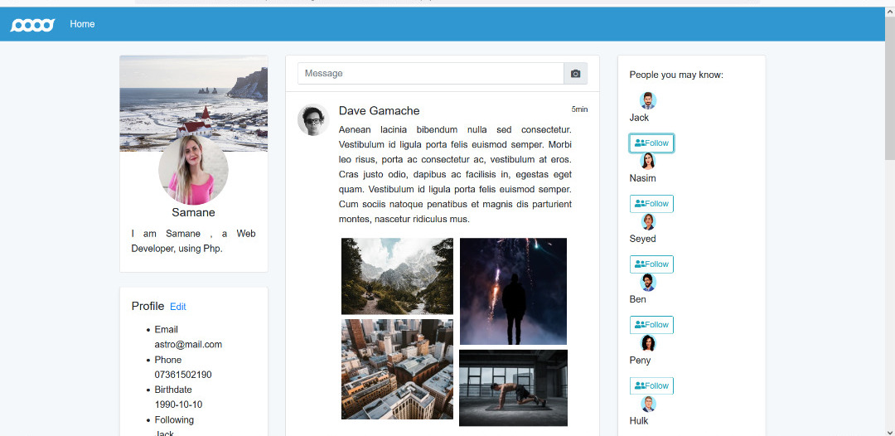
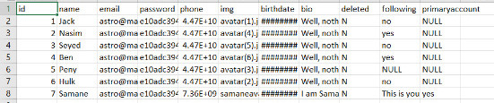

# Responsive social media template with PHP/MYSQL

This is a social media using php/mysql. 

Sql Table Inside:

I have tried to challange my self in this project and not used any of my previous codes or classes.
This is a pure work of only 5 hours to challange my ability to code php/mysql without any framework.

I believe the code has many rooms to improvement however the lack of timing was another challange which was
quite a good excercise.

Functionalities:
• Update profile details: name, email, phone number, date of birth, bio
• Upload a new, or remove an existing, avatar image from their local machine
• View other user’s profile pages and the content relevant to that user
• Follow, and unfollow, another user showing the status of relationship between
the two users
• Delete your own profile

Refrences:
#### (I have used a html/css templete for the start of front-end - templete reference: ##### A website template is similar to Twitter. It employs the use of Html, CSS, Bootstrap, and Javascript to build it.
 -  https://github.com/shohan-ch/social-network-template)